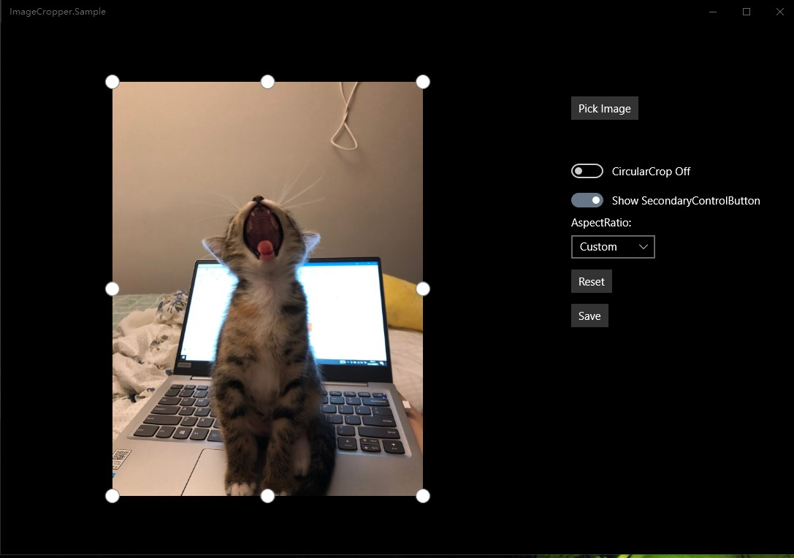
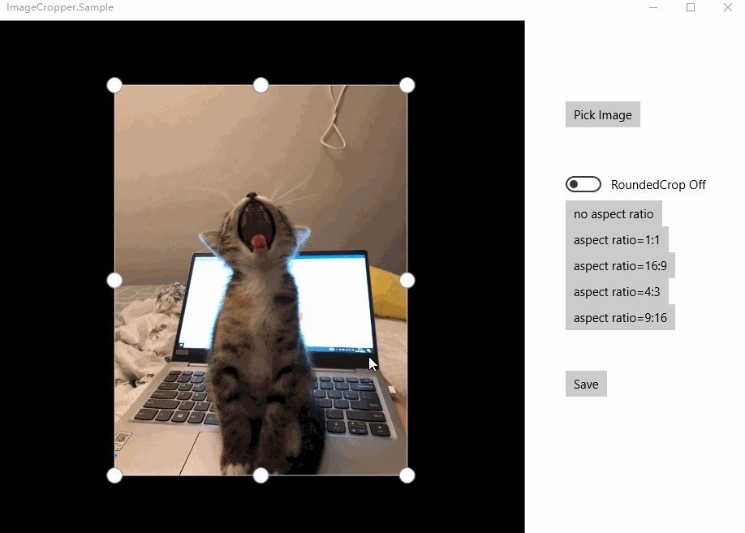

# ImageCropper
The ImageCropper Control allows user to crop image freely.
>Note: The ImageCropper is now included in the Windows Community Toolkit! The repo will no longer be maintained.
Go [WindowsCommunityToolkit](https://github.com/windows-toolkit/WindowsCommunityToolkit)!

这是一个仿照Windows 10 照片裁剪工具写的一个UWP图片裁剪控件，可实现类似Windows 10 照片相近的体验。

博客分享地址（最新修改时间2018.11.27）：

[[UWP]如何实现UWP平台最佳图片裁剪控件](https://www.cnblogs.com/hhchaos/p/10021952.html)

使用效果见下方动图。

## Download

UWP:download from [Nuget](https://www.nuget.org/packages/ImageCropper.UWP/)

## Sample App

[This is a sample app](https://github.com/HHChaos/ImageCropper/tree/master/ImageCropper.Sample)

